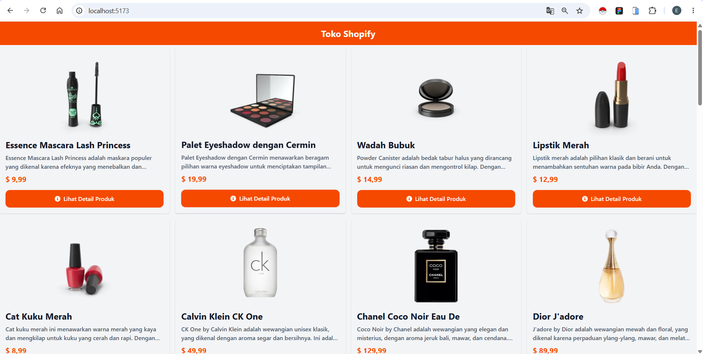
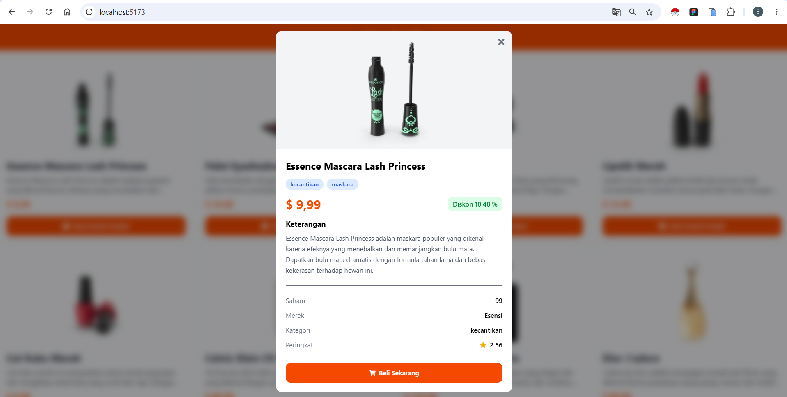

# 🛍️ Shopify Shop (DummyJSON API)

A simple e-commerce product catalog built with **React**, **Vite**, **Tailwind CSS**, and the **DummyJSON API**. This project was created as a learning exercise to understand how to fetch data from an API, manage application state, handle loading and error states, and display product details in a modern user interface.

## ✨ Features

* 📦 Fetch product data from DummyJSON API
* ⏳ Loading state while fetching data
* ❌ Error handling for failed requests
* 🖼️ Responsive product grid layout
* 🔍 Product detail modal
* 🏷️ Category & Brand badges
* ⭐ Product rating display
* 💰 Price & discount information
* 🛒 Buy Now button (UI only)
* 📱 Responsive design
* 🎨 Smooth hover animations
* 🚫 Background scroll lock when modal is open
* ⚡ Built with Vite for fast development

## 🛠️ Tech Stack

* React
* Vite
* Tailwind CSS
* React Icons
* DummyJSON REST API

## 📸 Preview




## 🚀 Getting Started

Clone this repository

```bash
git clone https://github.com/emil-prayoga/shopify-shop.git
```

Navigate into the project

```bash
cd your-repository
```

Install dependencies

```bash
npm install
```

Run the development server

```bash
npm run dev
```

Open

```text
http://localhost:5173
```

## 🌐 API

This project uses the free DummyJSON API.

https://dummyjson.com/products

Example endpoint:

```text
GET https://dummyjson.com/products
```

## 📚 What I Learned

During this project I learned about:

* React Hooks (`useState`, `useEffect`)
* Fetch API
* Async/Await
* Error Handling
* Loading State
* Conditional Rendering
* Rendering Lists with `map()`
* Modal Implementation
* UI Animation
* Working with REST APIs
* Responsive Layout using Tailwind CSS

## 🔮 Future Improvements

* React Router
* Product Detail Page
* Product Search
* Category Filter
* Pagination
* Wishlist
* Shopping Cart
* Dark Mode
* API Search
* Better UI/UX

## 📄 License

This project is for learning purposes.
